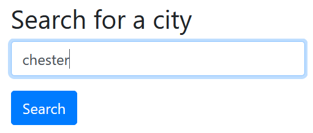
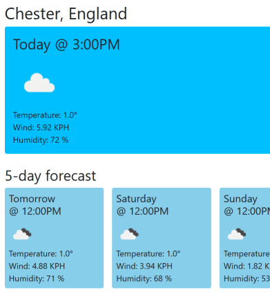
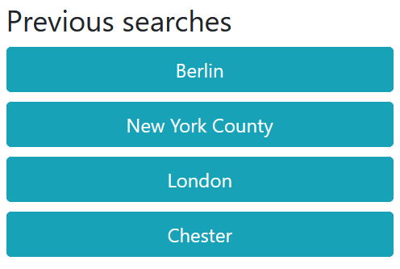

# Weather Dashboard

## Description

An application that lets you search for a location and, if found, displays its current weather and the following 5-day forecast.

The app will store a history of the last 7 locations searched, which will be preserved on page refreshes.

## Usage

The live application is hosted here, [https://fezzer.github.io/weather-dashboard/](https://fezzer.github.io/weather-dashboard/).

Use the searchbox to enter a location to search for and then click the search button.

If the location is found the app will display the weather for that location.

The location will be added to your history. Click a history entry to view the forecast for that location. The history will hold a maximum of 7 locations and is ordered by use. When the history limit is reached the oldest location will be replaced. The history is preserved in local storage.

## Credits

The app uses data provided by the API from [OpenWeather](https://openweathermap.org/).

## License

Please refer to the license in the repo.